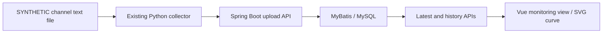

# SHM · Unified sensor readings

A work-in-progress structural health monitoring application: Python file ingestion, a Spring Boot / MyBatis API, MySQL storage, and a Vue 3 dashboard. This public project preserves the existing Fable5 refactor and adds reproducible **SYNTHETIC** examples around it.

[中文说明](docs/README.zh-CN.md) · [Run locally](docs/runbook.md) · [Architecture](docs/architecture.md) · [Verification and limits](docs/validation.md)

## What you can inspect

| Engineering problem | Implementation to review |
| --- | --- |
| Incremental ingestion from files that may still be written | [Collector](shm-backend-fable5-copy/tools/collector/os265/os265_collector): byte offsets, partial-line handling, persisted progress, bounded HTTP retries |
| Normalize readings while preserving their origin | [Ingestion service](shm-backend-fable5-copy/src/main/java/com/example/shm/vendorsource/service/impl/VendorSourceServiceImpl.java): input validation, source file/line metadata, channel mapping |
| Query one storage model through different monitoring views | [Schema](shm-backend-fable5-copy/docs/sql/vendor_source_unified_schema.sql) and [Mapper](shm-backend-fable5-copy/src/main/resources/mapper/vendorsource/VendorSourceReadingMapper.xml): origin uniqueness, latest/history queries |
| Keep polling views responsive | [MonitorModulePage.vue](shm-frontend-fable5-copy/src/components/monitor/MonitorModulePage.vue): independent in-flight requests, cancellation, stale-response checks, manual time windows |
| Plot the measured value without inventing variation | [Value conversion](shm-frontend-fable5-copy/src/utils/os265Value.js) and [chart geometry](shm-frontend-fable5-copy/src/utils/monitor/chartGeometry.js): primary/auxiliary separation, flat-series handling |

These are source-level design choices, not claims of production reliability or measured throughput.

## Data flow



The six views — displacement, acceleration, strain, vibration, stress and deflection — filter the **same unified readings** by module mapping. They do not implement six independent physical measurement algorithms. The demonstration maps CH2 to strain; other views can legitimately be empty.

The primary plotted value is the file's intensity/energy column. Wavelength is an auxiliary value. Neither the sample numbers nor the module labels establish calibrated physical units. **Prediction and crack pages are placeholders awaiting integration.**

## Try the small demo first

From the repository root, with Python 3.10+ and Node matching the frontend's `^20.19.0 || >=22.12.0` requirement:

```sh
python tools/demo/generate_synthetic.py
python -m unittest discover -s tools/demo -p "test_*.py" -v
node --test tools/demo/test_chart.mjs
```

The generator creates six deterministic, clearly named synthetic records at the collector's default input location. Tests exercise the real collector against a temporary loopback HTTP recorder, plus the frontend's real value/chart helpers. **The recorder is a test double, not the Java backend or MySQL.**

For the actual application chain, follow the [database → backend → collector → API → frontend runbook](docs/runbook.md). It includes expected row counts and values, a strict API verifier, and the exact UI time window. See [verification](docs/validation.md) for what was and was not run.

## Repository guide

- [Backend](shm-backend-fable5-copy): Java 17 target, Spring Boot 4, MyBatis, MySQL schema, Python collector.
- [Frontend](shm-frontend-fable5-copy): Vue 3, Vite, six monitoring views, retained compatibility code.
- [Technical references](shm-backend-fable5-copy/docs/PROJECT_BACKEND_STRUCTURE.md): [database](shm-backend-fable5-copy/docs/DATABASE_SCHEMA_REFERENCE.md), [API](shm-backend-fable5-copy/docs/API_ENDPOINTS_REFERENCE.md), [request JSON](shm-backend-fable5-copy/api/README.md).
- [Demo](tools/demo/README.md): generated inputs, local regression tests, API verification.
- [Architecture and discussion points](docs/architecture.md): responsibilities, trade-offs and current gaps.

## Current boundaries

This is an unfinished engineering project, not a production-ready monitoring or safety system. The backend's original Spring test is only a context-load test. Authentication/authorization, deployment hardening, physical calibration, device acceptance and complete end-to-end regression are not established by this repository. The original rate limiter does not provide authentication.

Old Git history, internal handoff material, backups, real measurement files, secrets, runtime logs and build/dependency output are excluded. The public history starts with a clean source snapshot; subsequent commits document actual public-repository improvements.

Existing third-party notices and dependency metadata are retained. No new license is granted here, and sanitization is not a legal determination of ownership.
