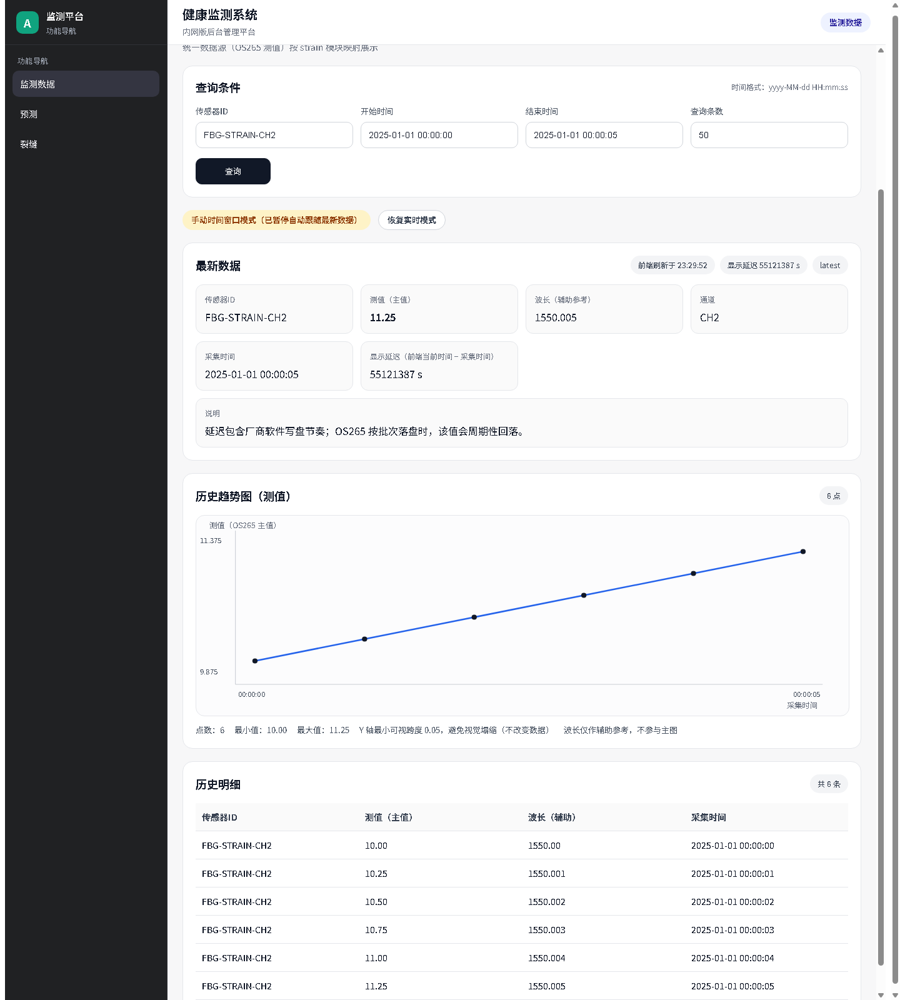

# SHM · OS265 Interrogator Integration & Dashboard

**Connect OS265 optical-fiber interrogator output to traceable readings and interactive trends.**

An engineering demo extracted from a real OS265 optical-fiber interrogator integration project for FBG sensing. A Python collector reads the channel files written by vendor software, then feeds a Spring Boot API, MySQL storage and a Vue monitoring dashboard.

[Quickstart](#quickstart) · [Full application demo](docs/runbook.md) · [Architecture](docs/architecture.md) · [Engineering notes](docs/validation.md) · [Security](SECURITY.md) · [中文](docs/README.zh-CN.md)


The **FBG → OS265 → vendor software → channel files → application** chain was validated in the original project's laboratory setup.

## Why this project

OS265 acquisition happens upstream, through the interrogator and its vendor software. This project's integration task is to bring the resulting channel records into a queryable monitoring application. Files may still be writing when the collector reads them; uploads can fail; a plotted reading needs a path back to its original channel record.

SHM connects those steps: follow appended records, normalize them through an API, preserve their origin in MySQL, and inspect latest readings or a selected time window in the browser.

## What it does

### Bring OS265 channel output into the application

The adapter connects the vendor software's channel TXT output to the application. Byte offsets and persisted progress support incremental collection and restart/resume. Partial-line handling, timeouts and bounded upload retries address the handoff from ongoing file acquisition to the backend.

### Trace a reading back to its source

Each canonical upload carries its source file, line and offset alongside the sensor, channel and collection time. The storage model uses source identity for duplicate protection, keeping ingestion and later inspection connected.

### Use one data model across monitoring views

A unified reading table and channel-to-module mapping serve latest/history queries. Six views — displacement, acceleration, strain, vibration, stress and deflection — share that model instead of duplicating the ingestion pipeline.

### Explore readings as they arrive

The Vue dashboard combines polling, manual time-window queries, SVG trends and a reading table. Independent in-flight guards, cancellation and stale-response checks keep overlapping requests under control. Primary readings and auxiliary wavelength stay separate.

## Demo preview



Actual Vue dashboard captured in Chrome: **SYNTHETIC channel input → original collector → Spring Boot → MySQL → query → dashboard**, with six values from 10.00 to 11.25. [Run details](docs/validation.md).

## Quickstart

**Replay OS265-format channel records without the interrogator or a database.** From a clone of this repository, with Python 3.10+:

```sh
python tools/demo/generate_synthetic.py
python -B -m unittest discover -s tools/demo -p test_demo.py -v
```

The first command creates six **SYNTHETIC** input records at `sample-data/os265/SYNTHETIC_demo_通道2.txt`. The second runs seven tests around the existing collector, including actual HTTP uploads to a local recorder, restart/resume and partial-line handling.

```text
SYNTHETIC: 6 invented records ready at ...
...
Ran 7 tests in ...
OK
```

The sample's primary values rise from **10.00 to 11.25**. The recorder demonstrates the collector locally; to run the Java/MySQL/dashboard chain, use the [application demo guide](docs/runbook.md), including setup commands, API checks and the exact chart time window.

[All demo tools](tools/demo/README.md) · [Tests and real application replay](docs/validation.md)

## Stack

| Layer | Technology |
| --- | --- |
| Device integration | FBG sensors → OS265 optical-fiber interrogator → vendor software → channel files |
| File ingestion | Python standard library; OS265-format text adapter |
| API and persistence | Java 17 target · Spring Boot 4 · MyBatis · MySQL 8 schema |
| Dashboard | Vue 3 · Vite · SVG charts |
| Local checks | Python unittest · Node test runner · deterministic synthetic fixtures |

## Inside the implementation

| Decision | Where to look |
| --- | --- |
| Preserve incremental progress and file origin | [Collector modules](shm-backend-fable5-copy/tools/collector/os265/os265_collector) |
| Validate once and resolve channel mappings centrally | [Ingestion service](shm-backend-fable5-copy/src/main/java/com/example/shm/vendorsource/service/impl/VendorSourceServiceImpl.java) |
| Keep origin uniqueness in storage | [Schema](shm-backend-fable5-copy/docs/sql/vendor_source_unified_schema.sql) · [Database reference](shm-backend-fable5-copy/docs/DATABASE_SCHEMA_REFERENCE.md) |
| Coordinate live and manual queries in one page | [Monitoring component](shm-frontend-fable5-copy/src/components/monitor/MonitorModulePage.vue) |
| Preserve a flat signal when its primary value is constant | [Value helpers](shm-frontend-fable5-copy/src/utils/os265Value.js) · [Chart geometry](shm-frontend-fable5-copy/src/utils/monitor/chartGeometry.js) |

[Backend layout](shm-backend-fable5-copy/docs/PROJECT_BACKEND_STRUCTURE.md) · [API reference](shm-backend-fable5-copy/docs/API_ENDPOINTS_REFERENCE.md) · [Request examples](shm-backend-fable5-copy/api/README.md)

## Project status

This demo brings together the **OS265 channel collector, unified latest/history APIs and six mapped monitoring views**. Prediction and crack integrations are planned extensions.

[Demo setup](docs/runbook.md) · [API reference](shm-backend-fable5-copy/docs/API_ENDPOINTS_REFERENCE.md) · [Engineering notes](docs/validation.md)
