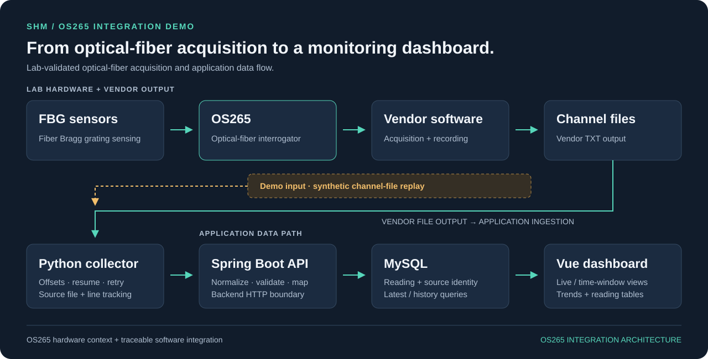

# SHM · OS265 光纤解调仪接入与监测看板

**把 OS265 光纤解调仪的采集输出，接入可追溯、可查询的监测看板。**

从真实 OS265 光纤解调仪接入项目中提取的工程 Demo：围绕 FBG 传感数据，由 Python 采集器读取厂商软件生成的通道文件，经 Spring Boot API 写入 MySQL，再由 Vue 看板展示读数和趋势。

[快速体验](#快速体验) · [完整应用演示](runbook.md) · [架构](architecture.md) · [工程记录](validation.md) · [English](../README.md)



原项目的 **FBG 传感器 → OS265 解调仪 → 厂商软件 → 通道文件 → 应用**链路已通过实验室验证。

## 为什么做这个项目

OS265 解调仪与厂商软件负责上游采集，本项目解决的是把它们输出的通道记录接入监测应用：文件可能尚未写完，上传可能失败，曲线上的一个点也需要追溯到原始通道记录。

SHM 把这些步骤连接起来：跟踪新增记录，通过 API 统一数据格式，在 MySQL 中保留来源信息，再由浏览器展示最新读数或指定时间窗口的变化。

## 核心能力

### 接入 OS265 通道输出，持续跟进新增记录

适配器以厂商软件生成的通道 TXT 文件为输入，通过字节偏移与持久化进度支持增量采集、重启续传，并处理半行、上传超时和有限次数重试，把持续写盘的 OS265 采集输出接到后端。

### 每条读数都有来源

标准上传携带来源文件、行号、偏移、传感器、通道和采集时间。数据库以来源身份约束重复记录，让“采到了什么”和“这个点从哪来”能够对应起来。

### 一条链路，多个监测视图

统一读数表与通道映射支撑 latest/history 查询。位移、加速度、应变、振动、应力、挠度六个视图共用数据模型，无需各自复制采集流程。

### 在曲线和明细之间检查数据

Vue 看板支持自动轮询、手动时间窗、SVG 趋势图和读数表。独立请求保护、取消请求与过期响应检查控制请求重叠；主测值和辅助波长分别展示。

## 快速体验

**无需 OS265 设备或数据库，先回放通道记录。** 克隆仓库后，在根目录使用 Python 3.10+：

```sh
python tools/demo/generate_synthetic.py
python -B -m unittest discover -s tools/demo -p test_demo.py -v
```

第一条命令生成六条 **SYNTHETIC（人工合成）** 记录，位置为 `sample-data/os265/SYNTHETIC_demo_通道2.txt`。第二条命令执行七项采集器测试，包含向临时本机录制服务实际发送 HTTP、重启续传和半行处理。

```text
SYNTHETIC: 6 invented records ready at ...
...
Ran 7 tests in ...
OK
```

合成主值从 **10.00 上升到 11.25**。本机录制服务用于演示采集器；Java / MySQL / 看板的完整启动、API 检查和图表时间窗见 [应用演示指南](runbook.md)。

[演示工具](../tools/demo/README.md) · [28 项测试记录与范围](validation.md)

## 技术栈

| 层次 | 技术 |
| --- | --- |
| 设备接入 | FBG 传感器 → OS265 光纤解调仪 → 厂商软件 → 通道文件 |
| 文件采集 | Python 标准库、OS265 文本格式适配 |
| API 与持久化 | Java 17 编译目标、Spring Boot 4、MyBatis、MySQL 8 schema |
| 监测看板 | Vue 3、Vite、SVG 图表 |
| 本地验证 | Python unittest、Node test runner、确定性合成样本 |

## 值得阅读的实现

| 工程决策 | 源码入口 |
| --- | --- |
| 持久化增量进度，保留文件来源 | [采集器模块](../shm-backend-fable5-copy/tools/collector/os265/os265_collector) |
| 集中校验上传、解析通道映射 | [入库服务](../shm-backend-fable5-copy/src/main/java/com/example/shm/vendorsource/service/impl/VendorSourceServiceImpl.java) |
| 在存储层约束来源唯一性 | [SQL schema](../shm-backend-fable5-copy/docs/sql/vendor_source_unified_schema.sql) · [数据库说明](../shm-backend-fable5-copy/docs/DATABASE_SCHEMA_REFERENCE.md) |
| 在同一页面协调实时与手动查询 | [监测页面](../shm-frontend-fable5-copy/src/components/monitor/MonitorModulePage.vue) |
| 主值恒定时保持曲线平直 | [读数转换](../shm-frontend-fable5-copy/src/utils/os265Value.js) · [绘图计算](../shm-frontend-fable5-copy/src/utils/monitor/chartGeometry.js) |

[后端结构](../shm-backend-fable5-copy/docs/PROJECT_BACKEND_STRUCTURE.md) · [API 参考](../shm-backend-fable5-copy/docs/API_ENDPOINTS_REFERENCE.md) · [请求示例](../shm-backend-fable5-copy/api/README.md)

## 当前状态

本 Demo 展示 **OS265 通道采集、统一 latest/history 查询和六个监测视图**，通过模块映射组织读数。后续扩展包括预测与裂缝数据接入。

[Demo 启动](runbook.md) · [API 参考](../shm-backend-fable5-copy/docs/API_ENDPOINTS_REFERENCE.md) · [工程记录](validation.md)
